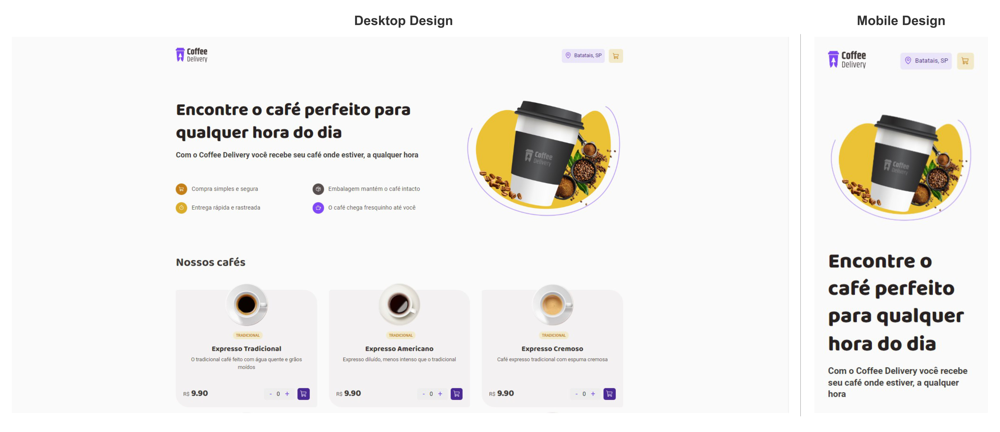

# Coffee Delivery

### Tabela de conteúdos

- [Coffee Delivery](#coffee-delivery)
    - [Tabela de conteúdos](#tabela-de-conteúdos)
  - [Visão Geral](#visão-geral)
    - [A Página](#a-página)
    - [Captura de Tela](#captura-de-tela)
    - [Links](#links)
  - [Desenvolvimento do conhecimento](#desenvolvimento-do-conhecimento)
    - [Recursos utilizados](#recursos-utilizados)
  - [Pré-requisitos](#pré-requisitos)
  - [Autor](#autor)

## Visão Geral
### A Página

Aplicação em ReactJS para escolha cafés com uma página Home para a seleção dos produtos e quantidades para itens no carrinho, uma página de Checkout com o formulário para endereço, seleção de método de pagamento e os itens do carrinho, podendo adicionar quantidades ou remover itens antes de fechar o pedido e uma página Success de aviso se a compra for bem sucedida.

### Captura de Tela

### Links

- URL da Solução : [Coffee Delivery](https://coffee-delivery-react.vercel.app/)

## Desenvolvimento do conhecimento

Para este projeto foi utilizado o pacote de ícones `phosphor-react` com um suporte muito bom ao ReactJS, todo css foi feito no método css-in-js com o `styled-components` e com a possibilidade de futuramente aplicar temas de cores ao projeto.

Na estrutura de navegação foram aplicados os conceitos do `react-router` que em uma nova implementação do código poderá ser acrescido a funcionalidade para verificar se o usuário está logado para ter acesso a páginas restritas e finalizar o pedido.

Dentro da página Checkout a validação dos formulários fica por conta dos `react-hook-form` trabalhando juntamente com o `zod`.

E para finalizar, a comunicação de estados dos elementos de páginas distintas está sendo realizada por contextos do ReactJS - `context-api`.

### Recursos utilizados

- [yarn](https://yarnpkg.com/) - Gerenciador de pacotes do projeto.
- [Vite](https://vitejs.dev/) - Criação da estrutura React.
- [ReactJS](https://pt-br.reactjs.org/) - Biblioteca React.
- [TypeScrip](https://www.typescriptlang.org/) - Uma linguagem de programação fortemente tipada que se baseia em JavaScript.
- [React Hook Form](https://react-hook-form.com/) - Validação dos campos do formulário.
- [Zod](https://github.com/colinhacks/zod) - Construtor de esquema para análise e validação.
- [PhosphorIcons](https://phosphoricons.com/) - Pacote de ícones 

## Pré-requisitos

Para visualizar a página hospedada basta clicar no link disponível acima nesta página.

Para executar o projeto *local* utilizamos os comandos:
> yarn install
> 
Logo em seguida:

> yarn run dev
> 
E a aplicação local poderá ser visualizada nas sua respectiva rotas:
`http://localhost:5173/`

## Autor

Danilo Calegaro - [danilocalegaro.dev.br](https://danilocalegaro.dev.br/)